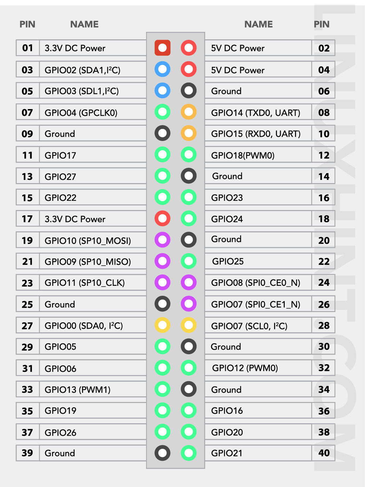

# Taaranator - Raspberry Pi Code

This repository contains the computer vision and control logic for the Taaranator robot, designed to run on a Raspberry Pi 4 with an Arducam camera.

## Hardware Requirements

- Raspberry Pi 4
- Arducam camera

### Pinout

| Pin | Function    |
|-----|-------------|
| 19  | MOSI        |
| 21  | MISO        |
| 23  | SCK         |
| 24  | CS0         |



## Software Setup

1. **Clone the repository:**
    ```bash
    git clone git@github.com:andrgv/taaranator_rpi.git
    cd taaranator_rpi
    ```

2. **Make the setup script executable and run it:**
    ```bash
    chmod +x setup.sh
    ./setup.sh
    ```

    This script will:
    - Update the system and install required packages
    - Create and activate a Python virtual environment (`slenv`)
    - Install Python dependencies from `requirements.txt`
    - Enable SPI and SSH via `raspi-config`

3. **Running the code:**

    After running the bash script, run the main python script:
    ```
    python main.py
    ```

    The `image.py` script will start the camera, run object detection using a YOLOv5 ONNX model, and display the results.

## Notes

- Ensure your camera is connected and enabled.
- For troubleshooting model outputs and scipt behavior, refer to debug logs generated and stored in `logs_dir/`.
